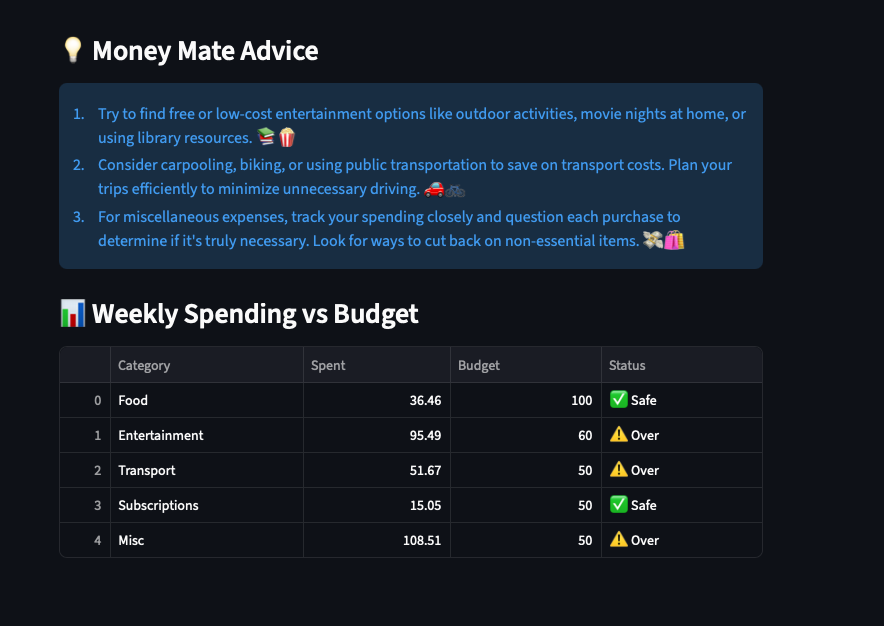

# Money Mate – AI-Powered Personal Finance Assistant


---

## Executive Summary

**Money Mate** is an AI-powered personal finance assistant designed to help individuals and families **stay on top of their spending**. Unlike generic budgeting apps, Money Mate **proactively analyzes your spending trends** and provides **actionable advice only for categories where you are overspending**. This ensures every tip is relevant, personalized, and impactful.  

This prototype demonstrates:  
- **AI prototyping & product thinking**  
- **Data analysis on real-world transactions**  
- **Customizable, interactive dashboard**  

---

## Key Features

### 1. **CSV Upload & Data Visualization**
- Upload your bank or mock transaction CSV.  
- View **raw data** and **weekly spending summaries**.  
- Dynamic charts highlight overspending categories.  


### 2. **Overspending-Focused AI Advice**
- AI generates **short, actionable tips** for categories where spending exceeds the budget.  
- Example:
  > 💡 Entertainment: You’re $45 over your weekly budget. Try a free movie night or attend local community events.  
- Safe categories like Food or Subscriptions that are within budget are **ignored**, making the advice highly targeted.



### 3. **Interactive Chat**
- Ask Money Mate questions like:  
  - “Which categories should I cut back on?”  
  - “How can I save $50 this week?”  
- The AI responds based on your uploaded spending trends.  

---

## Tech Stack

| Component | Purpose |
|-----------|---------|
| **Streamlit** | Rapid, interactive web interface |
| **Pandas** | Transaction data aggregation and analysis |
| **OpenAI GPT** | AI-powered personalized insights and chat |
| **Python 3.14** | Backend logic and computations |

---

## Why This Prototype Matters

- Demonstrates **real-world AI prototyping** without a full production backend.  
- Shows the ability to **analyze transactional data** and provide **actionable, personalized advice**.  
- Highlights **product thinking, AI integration, and Python skills** — ideal for a resume or portfolio.  
- Fully executive-ready for stakeholders, demonstrating **clear ROI and problem-solving for users**.

---

## Getting Started

1. Clone the repository:  
```bash
git clone https://github.com/JaishreeViswanathan/moneymate-ai-demo.git
cd moneymate-ai-app
